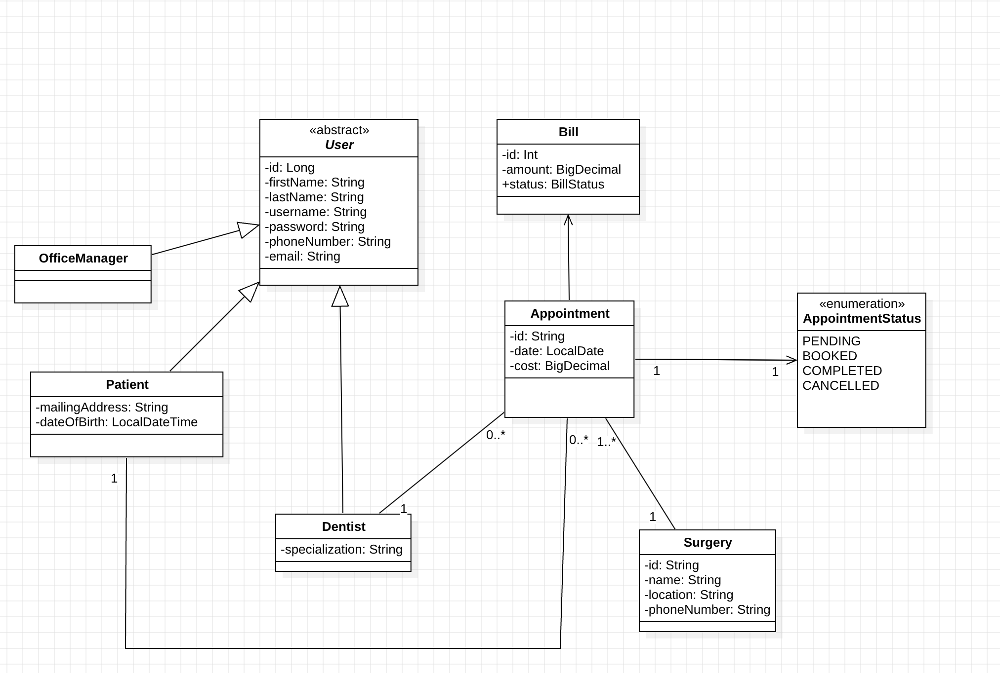
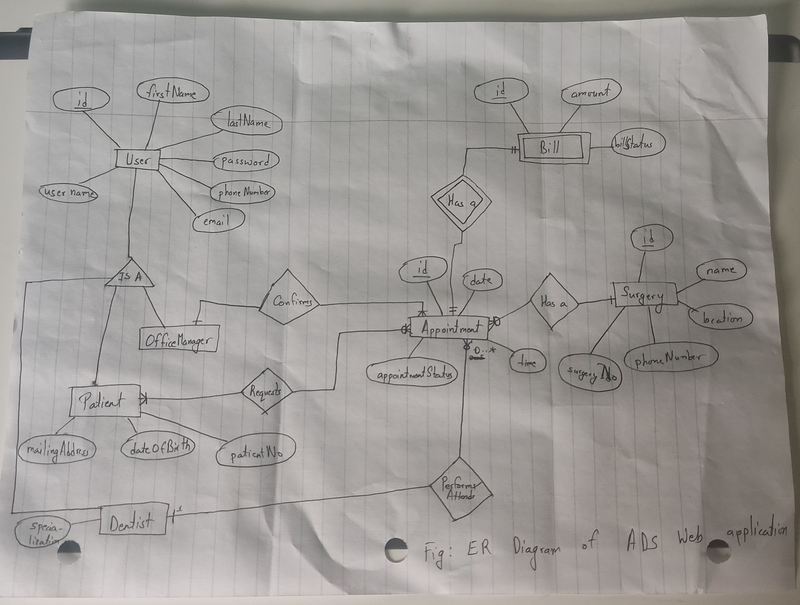

# Advantis Dental Surgeries (ADS) - Software Solution

## 1. System Overview

### Overview

This is a web-based software solution designed to manage the operations of Advantis Dental Surgeries (ADS), an organization with a network of dental surgeries located across cities in the South West region. The system will allow Office Managers to register and manage Dentists, Patients, and appointments. Dentists and Patients can also interact with the system for appointment scheduling, cancellations, and view their details.

### Software Requirements

#### Functional Requirements:

1. **Dentist Registration**:

   - The Office Manager can register Dentists into the system.
   - A unique Dentist ID will be generated for each Dentist.
   - The system stores Dentist details, including:
     - First Name
     - Last Name
     - Contact Phone Number
     - Email Address
     - Specialization

2. **Patient Registration**:

   - The Office Manager can register Patients into the system.
   - The system stores Patient details, including:
     - First Name
     - Last Name
     - Contact Phone Number
     - Email Address
     - Mailing Address
     - Date of Birth

3. **Appointment Request**:

   - Patients can request appointments through the website or by phone.
   - The system should allow the Office Manager to book an appointment upon receiving the request.
   - The system will send a confirmation email to the Patient once the appointment is booked.

4. **Appointment Details**:

   - Dentists can view a list of all their scheduled appointments along with Patient details (First Name, Last Name).
   - Patients can view their upcoming appointments and dentist details.

5. **Surgery Information**:

   - The system will provide information about the Surgery location including:
     - Name of Surgery
     - Location Address
     - Telephone Number

6. **Appointment Cancellation/Rescheduling**:

   - Patients can request to cancel or change their appointments through the system.

7. **Appointment Limitation**:

   - A Dentist cannot have more than 5 appointments scheduled within any given week.

8. **Outstanding Bill Check**:

   - The system prevents a Patient from requesting a new appointment if they have an outstanding, unpaid bill for previous dental services.

9. **Dentist Sign-in**:

   - Dentists should be able to sign into the system to view their appointments.

10. **Patient Sign-in**:
    - Patients should be able to sign into the system to view their appointments and request appointment changes or cancellations.

#### Non-Functional Requirements:

1. **Security**:

   - The system should have proper authentication and authorization for Dentists and Patients.
   - Sensitive information (like contact details) should be stored securely.

2. **Performance**:

   - The system should be able to handle multiple concurrent users (Dentists, Patients, and Office Managers) without significant performance degradation.

3. **Scalability**:

   - The solution should scale as the number of patients, dentists, and surgeries increases.

4. **Usability**:
   - The system should have a user-friendly interface for both patients and office managers to easily navigate and perform actions like registering, booking appointments, and viewing schedules.

#### System Analysis & Design

- **Domain Model Class Diagram**: (To be included)

  - This diagram illustrates the structure of the system, showing the relationships between classes such as `Dentist`, `Patient`, `Appointment`, `Surgery`, and `OfficeManager`.

- **Entity Relationship Diagram (ERD)**:

  - This diagram illustrates how entities like `Dentist`, `Patient`, `Appointment`, and `Surgery` relate to each other in the database.

  

### Technologies Used

- **Backend**: Spring Boot
- **Frontend**: React
- **Database**: PostgreSQL
- **Email Service**: Integrated email system for sending appointment confirmations

## Setup Instructions

1. Clone the repository to your local machine.
2. Navigate to the backend directory and run the Spring Boot application.
3. Open the frontend directory and run the React application.
4. Make sure to set up the MySQL database with the required tables.

## Contributors

- Suman Adhikari - Full Stack Software Engineer

---

## 2. Dummy Data to work with

### 2.1 User Table

Below is the list of users, their respective IDs, usernames, and passwords:

| User Type        | ID Field | Username  | Password |
| ---------------- | -------- | --------- | -------- |
| **Dentist**      | DENT-1   | tsmith    | pwd      |
| **Dentist**      | DENT-2   | hpearson  | pwd      |
| **Dentist**      | DENT-3   | rplevin   | pwd      |
| **Patient**      | PAT-100  | gwhite    | pwd      |
| **Patient**      | PAT-105  | jbell     | pwd      |
| **Patient**      | PAT-108  | imackay   | pwd      |
| **Patient**      | PAT-110  | jwalker   | pwd      |
| **Patient**      | PAT-115  | ajohnson  | pwd      |
| **Patient**      | PAT-120  | bwilliams | pwd      |
| **Office Admin** | -        | admin     | admin    |

### 2.2 Appointment Details

#### Patients with Pending and Paid Bills

| Patient Name  | Patient ID | Appointment ID | Bill Status |
| ------------- | ---------- | -------------- | ----------- |
| Gillian White | PAT-100    | APPT-1         | PENDING     |
| Jill Bell     | PAT-105    | APPT-2         | PAID        |
| Ian MacKay    | PAT-108    | APPT-3         | PAID        |
| John Walker   | PAT-110    | APPT-19        | PENDING     |
| Alice Johnson | PAT-115    | APPT-7         | PAID        |
| Bob Williams  | PAT-120    | APPT-8         | PAID        |

#### Dentists with More Than 5 Appointments This Week

| Dentist Name  | Dentist ID | Number of Appointments |
| ------------- | ---------- | ---------------------- |
| Tony Smith    | DENT-1     | 10                     |
| Helen Pearson | DENT-2     | 10                     |

#### Dentists with Less Than 5 Appointments This Week

| Dentist Name | Dentist ID | Number of Appointments |
| ------------ | ---------- | ---------------------- |
| Robin Plevin | DENT-3     | 2                      |

#### Appointment IDs with Bill Status

| Appointment ID | Dentist ID | Patient ID | Appointment Status | Bill Status |
| -------------- | ---------- | ---------- | ------------------ | ----------- |
| APPT-1         | DENT-1     | PAT-100    | SCHEDULED          | PENDING     |
| APPT-2         | DENT-1     | PAT-105    | COMPLETED          | PAID        |
| APPT-3         | DENT-2     | PAT-108    | COMPLETED          | PAID        |
| APPT-4         | DENT-2     | PAT-108    | CANCELLED          | PAID        |
| APPT-5         | DENT-3     | PAT-105    | SCHEDULED          | PENDING     |
| APPT-6         | DENT-3     | PAT-110    | COMPLETED          | PAID        |
| APPT-7         | DENT-1     | PAT-115    | COMPLETED          | PAID        |
| APPT-8         | DENT-2     | PAT-120    | COMPLETED          | PAID        |
| APPT-9         | DENT-1     | PAT-100    | SCHEDULED          | PENDING     |
| APPT-10        | DENT-1     | PAT-100    | SCHEDULED          | PENDING     |
| APPT-11        | DENT-1     | PAT-100    | COMPLETED          | PAID        |
| APPT-12        | DENT-1     | PAT-100    | COMPLETED          | PAID        |
| APPT-13        | DENT-1     | PAT-100    | COMPLETED          | PAID        |
| APPT-14        | DENT-2     | PAT-105    | SCHEDULED          | PENDING     |
| APPT-15        | DENT-2     | PAT-105    | SCHEDULED          | PENDING     |
| APPT-16        | DENT-2     | PAT-105    | SCHEDULED          | PENDING     |
| APPT-17        | DENT-2     | PAT-105    | COMPLETED          | PAID        |
| APPT-18        | DENT-2     | PAT-105    | COMPLETED          | PAID        |
| APPT-19        | DENT-3     | PAT-108    | SCHEDULED          | PENDING     |
| APPT-20        | DENT-3     | PAT-108    | COMPLETED          | PAID        |
| APPT-21        | NULL       | PAT-110    | PENDING            | PENDING     |
| APPT-22        | NULL       | PAT-110    | PENDING            | PENDING     |
